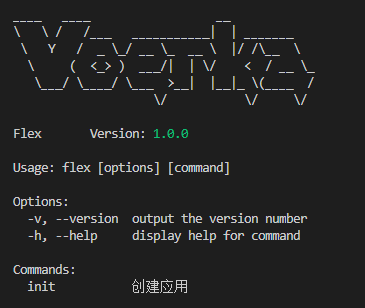
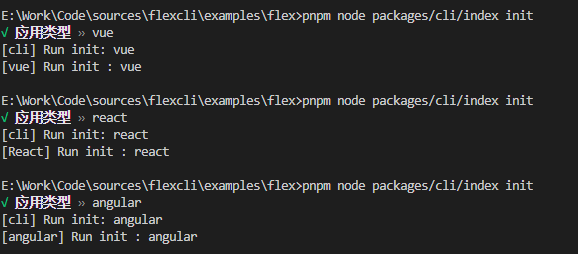
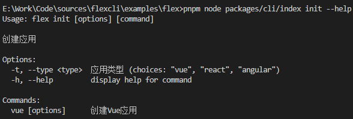

# 快速入门

`MixedCli`是一个命令行应用开发框架，其主要是对`commander`和`prompts`的封装，提供了更加友好的命令行开发体验。

以下我们将通过一个典型的`monorepo`工程，来介绍如何使用`MixedCli`开发命令行应用。

拟开发一个名为`flex`应用，该应用提供了`@flex/cli`，需要达成以下效果：

- `@flex/cli`提供了名称为`flex`的命令
- `flex init`用来初始化`vue`、`react`、`angular`应用
- `flex dev`用来启动开发应用
- 开发者要使用`flex`时，只需要安装`@flex/cli`，然后:
    如果要开发`vue`应用，则安装`@flex/vue`，则可以使用`flex init`创建`vue`应用开发
    如果要开发`react`应用，则安装`@flex/react`，则可以使用`flex init`创建`react`应用开发
    如果要开发`angular`应用，则安装`@flex/angular`，则可以使用`flex init`创建`angular`应用开发
- 如果开发者没有安装`@flex/cli`、`@flex/react`、`@flex/angular`中的任意一个，则执行`flex dev`时会用户选择其中的一个，或者在命令行通过`-t`来传入。
- 考虑到创建`vue`、`react`、`angular`应用的相关逻辑的不一样，我们不希望将所有逻辑代码均放在`@flex/cli`中，而分别位于`packages/vue`,`packages/react`,`packages/angular`中。这样最大的优点在于，由于应用逻辑并不存在于`@flex/cli`，`@flex/cli`仅是一个入口，所以`@flex/cli`可以保持稳定。

## 第1步：创建工程

首先创建一个`monorepo`工程，工程结构如下：

```shell
flex
  |-- packages
    |-- cli     // [!code ++]
    |-- vue
    |-- react
    |-- angular
  |-- package.json
```

示例工程名为`flex`，工程中的包名分别是`@flex/cli`、`@flex/angular`、`@flex/vue`、`@flex/react`。

## 第2步：创建命令行应用

`@flex/cli`是命令行应用，对外提供名称为`flex`的命令。

### 1. 安装依赖

::: code-group

```bash [npm]
npm install mixed-cli
```

```bash [pnpm]
pnpm add mixed-cli
```

```bash [yarn]
yarn add mixed-cli
```
:::

### 2. 创建`cli.js`

在`@flex/cli`包中创建`cli.js`文件，内容如下：

```
flex
  |-- pacakges
    |-- cli
      |-- cli.js
      |-- init.js
      |-- package.json

```

主要内容如下：

::: code-group

```ts [cli.js]
const { MixedCli } = require("mixed-cli") 

const cli = new MixedCli({
    name: "flex",
    version: "1.0.0",
    include: /^\@flex\//,  //  [!code ++]
    logo: String.raw`
        ____   ____                  __            
        \   \ /   /___   ___________|  | _______   
         \   Y   /  _ \_/ __ \_  __ \  |/ /\__  \  
          \     (  <_> )  ___/|  | \/    <  / __ \_
           \___/ \____/ \___  >__|  |__|_ \(____  /
                            \/           \/     \/`, 
})
cli.run()

```

```json [package.json]
{
  "name": "@flex/cli",
  "version": "1.0.0",
  "bin": {
    "flex": "cli.js"
  }
}
```

:::

`@flex/cli`仅仅是一个命令行的入口：

- **重点：**`include: /^\@flex\// `的意思是告诉`mixed-cli`,当执行`flex`命令时，会在当前工程中搜索以`@flex/`开头的包，然后包中声明在`cli`文件夹下的所有命令被合并到`flex`命令中。
- 上面所说的`当前工程`指的是安装了`@flex/cli`的工程，而不是我们的示例工程。
- `@flex/cli`中使用`cli.register(initCommand)`，注册一个通用的`init`命令，该命令的实现在`init.js`中。 一般可以在此工程提供一些通用命令,而其他的命令声明逻辑在分别在`@flex/*/cli/*.js`等包中实现。


## 第3步: 创建init命令

接下来,我们在`@flex/cli`中创建一个`init`命令。

```bash 
flex
 |-- pacakges
    |-- cli
       |-- cli.js
       |-- init.js   // [!code ++]
       |-- package.json 
```

编写`packages/cli/init.js`文件，内容如下：

 
```js 

const { MixedCommand } = require('mixed-cli');

/**
 * @param {import('mixed-cli').MixedCli} cli
 */
module.exports = (cli)=>{                
    const initCommand = new MixedCommand("init");
    initCommand
        .description("创建应用")         
        .option("-t, --type <type>", "应用类型",{choices:["vue","react","angular"]})
        .action((options)=>{            
            console.log("Run init:",options.type)
        })
    return initCommand
} 
    
   
``` 

然后，我们在`packages/cli/index.js`中注册`init`命令。

```js
const { MixedCli } = require("mixed-cli") 
const initCommand = require("./init")  // [!code ++]
const cli = new MixedCli({
    name: "flex",
    include: /^\@flex\//,  //  [!code ++] 
    //...
})
cli.register(initCommand)
cli.run()

```

现在执行`flex`命令，可以看到`init`命令已经被注册到`flex`命令行中了。



如果运行`flex init`，则会执行`init`命令就会自动提示用户选择,然后执行`action`函数。


## 第4步：命令选项分布式处理

在本例中，我们为`init`命令设计了`["vue","react","angular"]`三个选项。

- **常规处理方式**

常规情况下，我们会按照如下方式处理命令选项：

```js{9-15}
// packages/cli/init.js
const { MixedCommand } = require('mixed-cli');
module.exports = (cli)=>{                
    const initCommand = new MixedCommand("init");
    initCommand
        .description("创建应用")         
        .option("-t, --type <type>", "应用类型",{choices:["vue","react","angular"]})
        .action((options)=>{            
            if(optins.type === "vue"){
                // ...
            }else if(optins.type === "react"){
                // ...
            }else if(optins.type === "angular"){
                // ...
            }
        })
    return initCommand
} 
```

这种处理方式下，我们需要在`@flex/cli`中包含所有的`vue/react/angular`处理逻辑的代码，这样会导致`@flex/cli`包变得臃肿并且不易维护。

更好的处理方式是，将处理逻辑分别放在`@flex/vue/cli/init.js`、`@flex/react/cli/init.js`、`@flex/angular/cli/init.js`中。

- **分布式处理方式**

**`MixedCli`提供了这样的分布式处理命令选择的能力。**

我们分别在`@flex/vue/cli/init.js`、`@flex/react/cli/init.js`、`@flex/angular/cli/init.js`中实现`init`命令的处理逻辑。

::: code-group

```js [packages/vue/cli/init.js]
const { MixedCommand,BREAK } = require('mixed-cli');
module.exports = (cli)=>{                
    cli.find("init").then(initCommand=>{
      initCommand
          .action((options)=>{      
              if(options.type === "vue"){     
                console.log("[vue] Run init :",options.type)
                return BREAK
              }
          })
    });        
}     
```

```js [packages/react/cli/init.js]
const { MixedCommand,BREAK } = require('mixed-cli');
module.exports = (cli)=>{                
    cli.find("init").then(initCommand=>{
      initCommand
          .action((options)=>{      
              if(options.type === "react"){     
                console.log("[react] Run init :",options.type)
                return BREAK
              }
          })
    });        
}     
```

```js [packages/angular/cli/init.js]
const { MixedCommand,BREAK } = require('mixed-cli');
module.exports = (cli)=>{                
    cli.find("init").then(initCommand=>{
      initCommand
          .action((options)=>{      
              if(options.type === "angular"){     
                console.log("[angular] Run init :",options.type)
                return BREAK
              }
          })
    });        
}     
```
:::

- 在`src/cli`目录下创建`init.js`文件，用于声明`init`命令。`cli`目录下的所有`js`文件会被自动加载,每个文件均导出一个函数，该函数需要返回一个或多个`MixedCommand`实例。`cli`目录是一个默认的约定目录，可以通过`cli.cliDir`参数修改。
- 创建`MixedCommand`实例，用于声明命令。`MixedCommand`继承自`commander`的`Command`类，因此可以使用`commander`的所有特性。
- `package.json`只需要将`mixed-cli`添加为依赖即可。




## 第5步: 开发子命令

以上是分布式处理命令选项的方式，`MixedCli`也支持创建子命令。

以下在`@flex/vue`中创建`init vue`子命令。

 
```js
// @flex/vue/cli/create_vue.js
const { MixedCommand } = require('mixed-cli'); 
module.exports = (cli)=>{                

    cli.find("init").then((initCommand)=>{
      const initVueCommand = new MixedCommand("vue");
        initVueCommand
          .description("创建Vue应用")  
          .option("-a, --app <value>", "应用名称",{validate:(value)=>value.length>5})})                           
          .action((options)=>{            
              console.log("创建Vue应用:",options.app)
          })
      initCommand.addCommand(initVueCommand)  // [!code ++]
    })    
} 
```

然后当执行`flex init vue`时，会看到如下输出：


此时执行`flex init --help`可以看到`vue`子命令的帮助信息：




## 第6步: 自动推断交互提示

接下来我们创建一个`dev`命令, 用于启动开发服务器，展示交互提示。


::: code-group

```js [packages/cli/dev.js]
const { MixedCommand } = require('mixed-cli');

/**
 * @param {import('mixed-cli').MixedCli} cli
 */
module.exports = (cli)=>{                
    const devCommand = new MixedCommand("dev");
    devCommand
        .description("开发模式")          
        // 指定了默认值且强制提示
        .option("--count <value>","数量",{default:5,prompt:true})
        // 没有指定默认值，使用,分割多个值
        .option("-r,--routes <value...>","路由(多个值采用,分割)")                           
        // 指定了默认值时不进行提示
        .option("-p,--port <port>","指定端口号",3000)                      
        // 有默认值且强制显示提示
        .option("-d,--debug" ,"调试模式",{ default:true,prompt:true })      
        .option("--color <value...>","显示颜色",{choices:["red","yellow","blue"],prompt:"multiselect"})  
        // 未指定默认值,使用自动完成，可以输入任意值
        .option("--filter <value>","文件过滤",{choices:["src","test","debug"],prompt:"autocomplete"})    
        .option("-h,--host <host>","指定主机名",{default:"localhost",prompt:true})                            // 自动提示（没有输入且无默认值时）
        // 始终不进行提示取，取决env是可选还是必选
        .option("-e,--env [value]","环境变量",{ prompt:false })                                   
        .option("-m,--mode <mode>","指定模式",{choices:["development","production","test","debug"]})
        .option("-f,--framework [value]","开发框架",{choices:[
            {title:"vue",value:1},
            {title:"react",value:2,description:"默认"},
            {title:"angular",value:3}
        ]})
        .option("-o,--open","自动打开浏览器",{prompt:{          // 自定义提示
            type:"toggle",
            message:"是否自动打开浏览器？",
        }})
        .action((options)=>{            
            console.log("        run dev app")
            console.log("dev app",options)
        })
    return devCommand
} 
    
```

```js [packages/cli/index.js]
const { MixedCli } = require("mixed-cli") 
const initCommand = require("./init") 
const devCommand = require("./dev")
const cli = new MixedCli({
    name: "flex",
    version: "1.0.0",
    include: /^\@flex\//,  

})
cli.register(initCommand)
cli.register(devCommand)//  [!code ++]
cli.run() 
```
:::

当执行`flex dev`时，会看到如下输出：


- 命令行的交互体验与使用`commander`时完全一样
- 仅当选项未指定默认值或满足一定条件时，才会根据一定的规则自动推断交互提示类型。详见[自动推断交互提示](./guide/infer-prompt.md)
- `MixedCli`使用`prompts`来实现交互提示，因此支持`prompts`的所有交互类型特性。详见[prompts](https://github.com/terkelg/prompts)

## 第7步: 开发命令

最后就是开发命令了，此时轮到开源工具库`logsets`上场了。

`logsets`是一个终端增强显示组件，用来在终端中显示表格、列表、树形结构等数据，提供更好友好的终端交互体验。

以下是`logsets`的使用示例：

```js
const { MixedCommand } = require('mixed-cli');

 
module.exports = (cli)=>{                
    const devCommand = new MixedCommand("dev");
    devCommand
        .description("开发模式")          
        .action(async ()=>{
            const tasks = logsets.createTasks([
              {
                  title:"任务处理被停止",
                  execute:async ()=>{
                      await delay(100)
                      return "abort"
                  }
              },
              {
                  title:"开始扫描文件",
                  execute:async ()=>{await delay(100);return 1}            
              },
              {   title:"准备对文件进行预处理",
                  execute:async ()=>{throw new Error("已安装")}, 
              },
              {   title:"准备对文件进行预处理",
                  execute:async ()=>{
                      await delay(100)
                      return "已完成"
                  }
              },
              {   title:"执行过程中显示进度",
                  execute:async ({task})=>{
                      for(let i=0;i<100;i++){
                          await delay(100)
                          task.note(i+"%")
                      }
                  }
              },
              {
                  title:"读取文件并编译成exe文件",
                  execute:async ()=>{
                      await delay(100)
                      return ['stop',"不干了"]
                  }            
              },        
              {
                  title:"任务处理被停止",
                  execute:async ()=>{
                      await delay(100)
                      return ["abort",'真的不干了']
                  }
              },
              "-",
              {
                  title:"任务执行失败",
                  execute:async ()=>{throw new Error("TimeOut")},
                  error:["ignore","忽略:{message}"]
              },
              {
                  title:"任务待办状态",
                  execute:async ()=>{throw new Error("TimeOut")},
                  error:"出错了"
              },    
              "出错处理",
              {
                  title:["下载文件：{},大小:{}, 已下载{}","package.json",122,344],
                  execute:async ()=>{throw new Error("TimeOut")},
                  error:"出错了:{message}"
              },
              {
                  title:["下载文件：{},大小:{}, 已下载{}",["package.json",122,344]],
                  execute:async ()=>{throw new Error("TimeOut")},
                  error:()=>"X"
              },
              {
                  title:["下载文件：{},大小:{}, 已下载{}",["package.json",122,344]],
                  execute:async ()=>{throw new Error("TimeOut")},
                  error:()=>"skip"
              },      
          ],{ignoreErrors:true})
          try{
              let results = await tasks.run(["开始执行{}任务",5])
              console.log(results)            
          }catch(e){
              console.error(e)
          }
    })
```

执行`flex dev`，会看到如下输出：


更多的`logsets`使用示例，请参考[logsets](https://zhangfisher.github.io/logsets/)


## 小结

- `MixedCli`是一个基于`commander`的命令行工具开发框架，提供了一套命令行开发的最佳实践。
- `MixedCli`能对所有命令行选项自动推断交互提示类型，当用户没有输入选项时，会自动引导用户输入选项，提供友好的用户体验。
- `MixedCli`可以在当前工程自动搜索满足条件的包下声明的命令进行合并，从而实现扩展命令的目的。此特性可以保持@flex/cli包的精简和稳定，给用户一致的体验。


